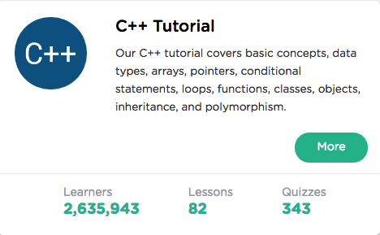

```
Roberto Nogueira  
BSd EE, MSd CE
Solution Integrator Experienced - Certified by Ericsson
```
# Sololearn C++



**About**

Learn everything you need to about the subject of this `Sololearn C++`  project.

[Homepage](https://www.sololearn.com/Course/CPlusPlus/)

## Topics
```
[x] Basic Concepts
[x] Conditional and Loops
[x] Data Types, Arrays, Pointers
[x] Functions
[x] Classes and Objects
[x] Challenges
[ ] More On Classes
[ ] Inheritance & Polymorphism
[ ] Templates, Exceptions, and Files
[ ] Challenges
[ ] Certificate
```
